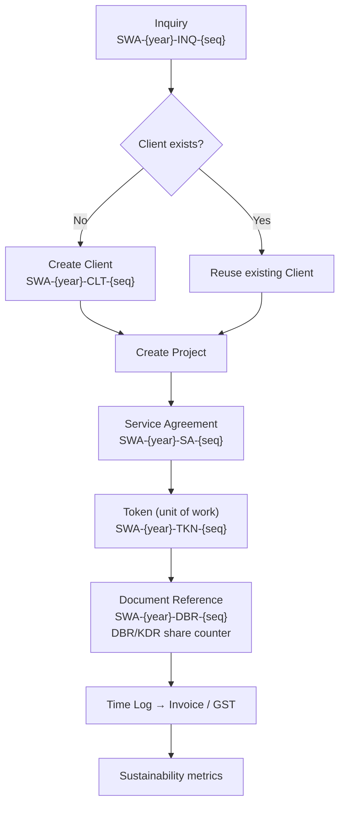

# SWA ERP

Internal ERP for **SWA Consultancy** (Ahmedabad) — an insulation engineering firm that today runs operations across ~20 live Excel sheets on OneDrive. This system digitizes that workflow: same business logic, one system, JWT + role-based access.

**Product v1.0.1 is built.** Professional-grade track **waves 32–39 shipped** (CI, coverage, frontend tests, load, observability, adversarial review + packaging, repo org). Company-server **deploy remains external** (Viraj / no IT dept). Residual ops risks are listed honestly in the wave-37 report — not claimed as "zero risk / 100% complete."

**Production seal (director cutover):** follow [`docs/SEAL_PROTOCOL.md`](docs/SEAL_PROTOCOL.md) — Graphify census + hostile truth suite + sheet-parity + director path. Metrics in this file are only numbers re-run in the seal session cited in the table.

---

## The core business flow

What the client actually asked for (Meeting 1 + Meeting 2), not a generic CRM:



ID format everywhere: `SWA-{year}-{TYPE}-{seq:03d}`, counter resets each calendar year. Confirmed with Viraj — see [`docs/decisions/0002-core-id-chain-gap.md`](docs/decisions/0002-core-id-chain-gap.md).

---

## Verified quality metrics

Every number below traces to a wave report or independent re-verify. Safe wording only.

| Area | Claim | Source |
|------|--------|--------|
| **Frontend (vitest, functions)** | **62.28%** functions · 65.73% statements · 59.1% branches · 67.11% lines · **0 failed** | `npx vitest run --coverage` (2026-09-22 seal session) |
| **Backend suite (full, Docker up)** | **673 passed, 2 skipped, 0 failed** | `python3 -m pytest tests/ -q` (2026-09-22 seal session, 184s) |
| **Migrations** | Single Alembic head **0043** | `alembic -c src/backend/alembic.ini heads` (2026-09-22) |
| **Production seal protocol** | Phase 0 census/graphify + hostile truth gates documented | [`docs/SEAL_PROTOCOL.md`](docs/SEAL_PROTOCOL.md) |
| **Backend static gates** | **ruff clean, black clean, mypy clean** (162 files); repo-wide `ruff check .` clean | this session |
| **Frontend suite** | **600 passed / 0 failed** (76 files) | `npx vitest run` (2026-09-22) |
| **Frontend coverage** | **Statements 65.72%**, **Branches 59.05%**, **Functions 62.37%**, **Lines 67.03%** | `npx vitest run --coverage` (2026-09-22) |
| **Frontend static gates** | **tsc clean (zero excludes), eslint clean, vitest thresholds met** | `npx tsc --noEmit`, `npx eslint`, `npx vitest run --coverage` (2026-09-22) |
| **Load** | **10 / 50 / 100 / 150** concurrent users on a **dev machine**; aggregate **p95 ≈ 29–130 ms**; **no server 5xx** after harness fix. **Not** the client's Windows Server. | [`docs/PERFORMANCE.md`](docs/PERFORMANCE.md), wave-35 |
| **CI** | Real fail gates — **0** `\|\| true` / `continue-on-error` in `.github/workflows/`; coverage floor `--cov-fail-under=82`; pip-audit (strict, 2 documented dev-only ignores) / npm audit (**0 vulnerabilities**) / semgrep + Trivy / gitleaks wired; pip + npm caching; E2E gated in `e2e.yml`; Dependabot weekly | workflows on disk 2026-09-22; scans re-run locally |
| **Observability** | `/metrics` (Prometheus, auth-gated by default), `/healthz` + `/readyz`, optional Sentry (`SENTRY_DSN`) | [`docs/operational/OBSERVABILITY.md`](docs/operational/OBSERVABILITY.md), wave-36 |
| **Alembic** | Single head **0043**; `alembic check` clean | `alembic -c src/backend/alembic.ini heads && check` (2026-09-22) |
| **Backend coverage** | **83%** (`TOTAL 9171 1543`); suite **673 passed, 2 skipped, 0 failed** | `python3 -m pytest tests/ -q --cov=src/backend --cov-report=term` → `work/reports/seal/backend-cov-raw.txt` (2026-09-22, 168.65s) |

**Do not claim:** "no backend module under 70%" globally (9+ non-alembic modules still under — see verdict). Always cite fresh output paste.

---

## Tech stack (+ why)

| Layer | Choice |
|-------|--------|
| Backend | Python 3.11 · FastAPI · SQLAlchemy 2 · Pydantic v2 · PostgreSQL · Redis |
| Workers | **Celery** (built, wave-31) — async export `?async=true` + `GET /api/jobs/{id}` |
| Storage | `StorageBackend` — **local** `uploads/` default; **MinIO** opt-in (`STORAGE_BACKEND=minio`, wave-31) |
| Frontend | React 18 · Vite · TypeScript · Tailwind · shadcn/ui · TanStack Query |
| Auth | JWT + bcrypt · RBAC (admin / pm / designer / auditor / viewer) |
| Deploy | Docker Compose |

Decision record: [`docs/decisions/0001-tech-stack.md`](docs/decisions/0001-tech-stack.md).

---

## Run it — SWA real sheets (USE THIS)

```bash
cp .env.example .env
make install
make dev                 # UI :3100 · API :8100 (separate terminal OK)
make swa-live-local      # wipe + load resources/ERP Sheets + link chain
```

Login: `admin@swa.co.in` / `admin123!`
You should see **`SWA-2025-…`** IDs under **Inquiries**, **Tokens**, **Document refs**.

| Surface | URL |
|---------|-----|
| UI | http://127.0.0.1:3100 |
| API docs | http://127.0.0.1:8100/docs |

**Do not** show SWA `make seed-demo` as the product — that is synthetic sandbox only.
Meeting / screen-share: [`deliverables/MEETING_AND_GO_LIVE_GUIDE.md`](deliverables/MEETING_AND_GO_LIVE_GUIDE.md).
Real data notes: [`docs/REAL_DATA.md`](docs/REAL_DATA.md).

---

## Where the detail lives

| Doc | Purpose |
|-----|---------|
| [`docs/ARCHITECTURE.md`](docs/ARCHITECTURE.md) | System diagrams (built vs target marked) |
| [`deliverables/TECHNICAL_REPORT.md`](deliverables/TECHNICAL_REPORT.md) | Engineering case study (requirements misread → recovery) |
| [`deliverables/SUBMISSION.md`](deliverables/SUBMISSION.md) | Handover package + honest limitations |
| [`deliverables/MEETING_AND_GO_LIVE_GUIDE.md`](deliverables/MEETING_AND_GO_LIVE_GUIDE.md) | Client meeting + screen-share + go-live (the one file) |
| [`resources/MEETINGS_MASTER.md`](resources/MEETINGS_MASTER.md) | What the client said |
| [`docs/PERFORMANCE.md`](docs/PERFORMANCE.md) | Load-test methodology + CSVs |
| [`work/ACTIVE.md`](work/ACTIVE.md) | Live wave status (32–51) |
| [`docs/historical/ANTI-FABRICATION.md`](docs/historical/ANTI-FABRICATION.md) | Metric honesty rules |

---

## Status (honest)

| Track | Status |
|-------|--------|
| Product MVP (waves 1–31) | Shipped (`v1.0.1`) — core ID chain, GST invoices, RBAC, importer, MinIO + Celery |
| Professional-grade (32–39) | **All shipped** — CI, coverage, frontend suite, load, observability, adversarial review, packaging, repo org |
| Wave-37 independent review | **Shipped** — [`work/reports/wave-37/01-independent-review.report.md`](work/reports/wave-37/01-independent-review.report.md) (critical fixes landed; residual RISKs documented) |
| Wave-38 submission package | **Shipped** |
| Hardening (40–51) | **All shipped** — logging, CSP, token rotation, pagination, atomicity, IDOR, metrics auth, deterministic tests, final re-seal |
| Company-server deploy | **External blocker** — no IT dept; server facts open ([`deliverables/SEND_IT.md`](deliverables/SEND_IT.md)) |