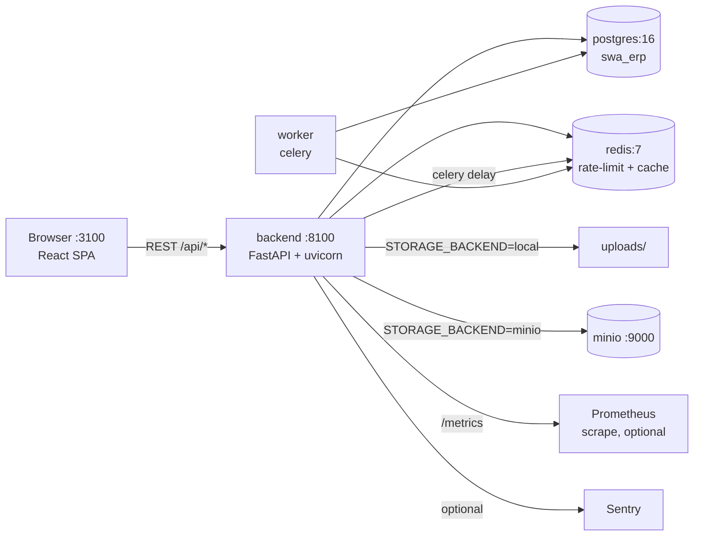
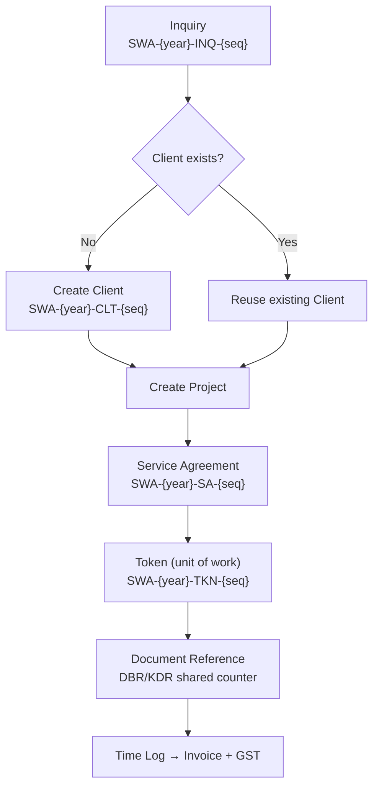

# SWA ERP — Architecture (as built, verified 2026-09-21)

> This file describes the system **as it exists in this repo**, not a target
> vision. Anything planned-but-unbuilt is listed in §7, not drawn as real.

## 1. Runtime topology (docker-compose)



`migrate` is a one-shot compose service (`alembic upgrade heads`).
`adminer :8180` is dev-only. Prod compose adds `worker` (async exports would
otherwise queue with no consumer) and drops adminer.

## 2. Backend layering (enforced by convention, audited)

```
api/<entity>.py        FastAPI routers: auth, validation, HTTP mapping ONLY
  → services/<entity>_service.py   business logic, audit entries, commits
    → db/repositories/<entity>_repo.py   queries: list_*, get_by_id, create, update, soft_delete
      → models/<entity>.py         SQLAlchemy 2 declarative (UUID PKs)
        → postgres                 Alembic migrations (single head; 0038 now)
```

Cross-cutting: `core/` (config, security/JWT, deps, rate_limit, middleware
with `X-Request-ID`, metrics, storage abstraction, workflow guards).
Schemas: Pydantic v2 for every input/output; money as `Decimal(18,2)` /
`Numeric(18,2)`, serialized as JSON strings.

## 3. Core domain flow (the client ask, not generic CRM)



Reference IDs: `generate_reference_id()` is atomic via
`INSERT … ON CONFLICT` on `reference_counters` (race-safe; concurrency-tested).
Project lifecycle: Lead → Quote → Awarded → Design → Vendor → Execution →
Validation → Closed (transition guard in `core/lifecycle.py`).

## 4. Auth & access

JWT access (short TTL) + refresh (rotating family, reuse detection revokes the
family, stored hashed in `refresh_tokens`). `users.token_version` invalidates
all sessions on demand. Passwords: bcrypt cost 12. RBAC hierarchy:
admin ⊃ pm ⊃ {designer, auditor} ⊃ viewer; project-scoped checks on top.
Auth endpoints IP-rate-limited; uploads/exports/reports throttled per IP.
`/metrics` requires auth; `/healthz` (liveness) + `/readyz` (DB+Redis+migrations).

## 5. Frontend

React 18 · Vite · TypeScript strict · Tailwind + shadcn/ui · TanStack Query.
Route-level code splitting (`React.lazy` + `Suspense` + `ErrorBoundary`).
Hooks (`useX`) wrap `lib/api.ts`; 69 vitest files, 586 tests. No `any` in
production code; hook-test mocks are type-checked by `tsc` (no excludes).

## 6. Data & integrity rules

- Money: `Numeric(18,2)` everywhere, no `Float`; INR default; GST at invoice
  level (`gst_percent` + computed `gst_amount`).
- Time: 15-minute increments enforced; billable vs non-billable + billed flags.
- Soft-delete (`deleted_at`) on all business data — see `docs/conventions.md`
  matrix for the deliberate hard-delete exceptions (audit log, counters,
  refresh tokens, export jobs, task edges, notifications, compliance seeds).
- Compliance standards (NBC/ECBC/IGBC/IS) are seeded reference rows, not enums.

## 7. Built vs deferred (honest)

| Capability | Status |
|---|---|
| Multi-tenancy / org isolation | **Absent** — single-tenant internal tool by design |
| API versioning | **Header strategy (v1)** — `X-API-Version` on `/api/*`, OpenAPI version = package version; additive-only within a major; first breaking change ships `/api/v2`, v1 kept 6 months |
| Idempotency keys on POST | **`Idempotency-Key` on invoice create / generate-from-time / status** — replay stored response, same-key-different-body rejected 422, 24h TTL (`idempotency_keys`, migration 0042) |
| Blue-green / canary / feature flags | **Absent** — compose up/down + migrate; rollback = restore from backup |
| E2E (Playwright) | **49/49 passed** (login flow, dashboard, BOQ/quote flow, page smokes) on the rebuilt stack; gated in CI via `e2e.yml` |
| Contract / property / mutation tests | **Partial** — hypothesis property tests (`test_properties.py`) + auth-coverage contract sweep (`test_api_contract.py`) live; mutation testing deferred |
| Offline / multi-region DR | **Absent** — single host; RPO ≈ 24h via daily backups (restore proven) |
