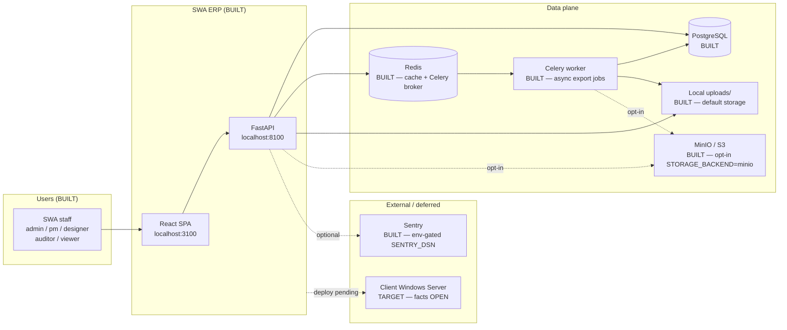
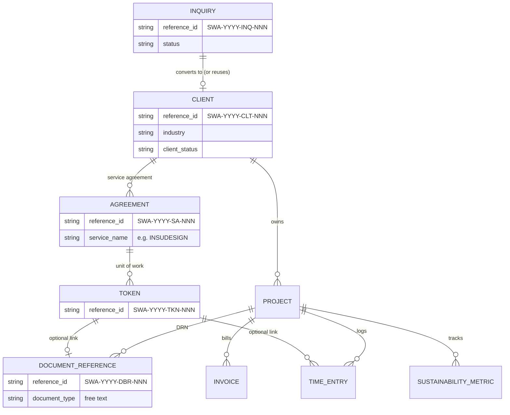
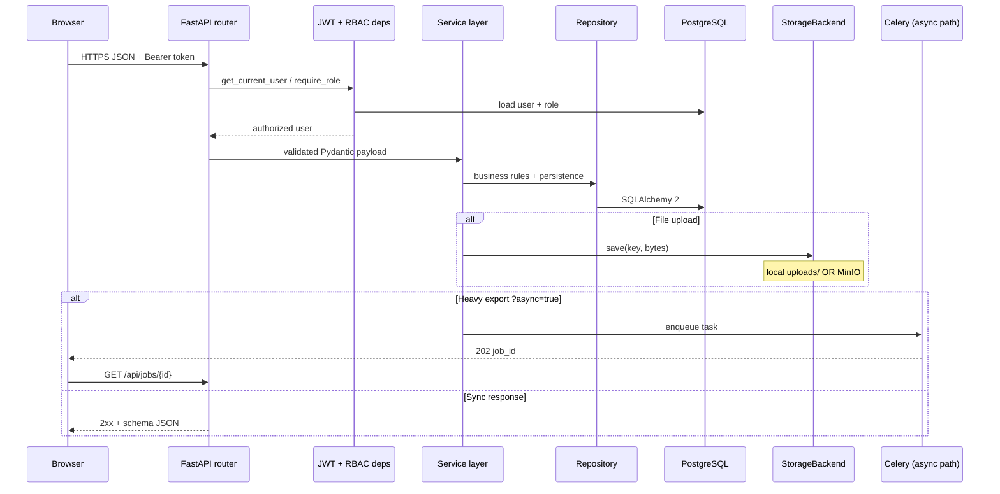
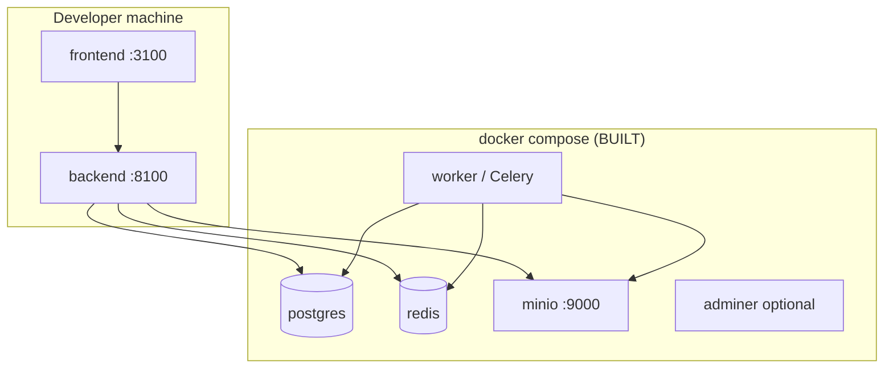
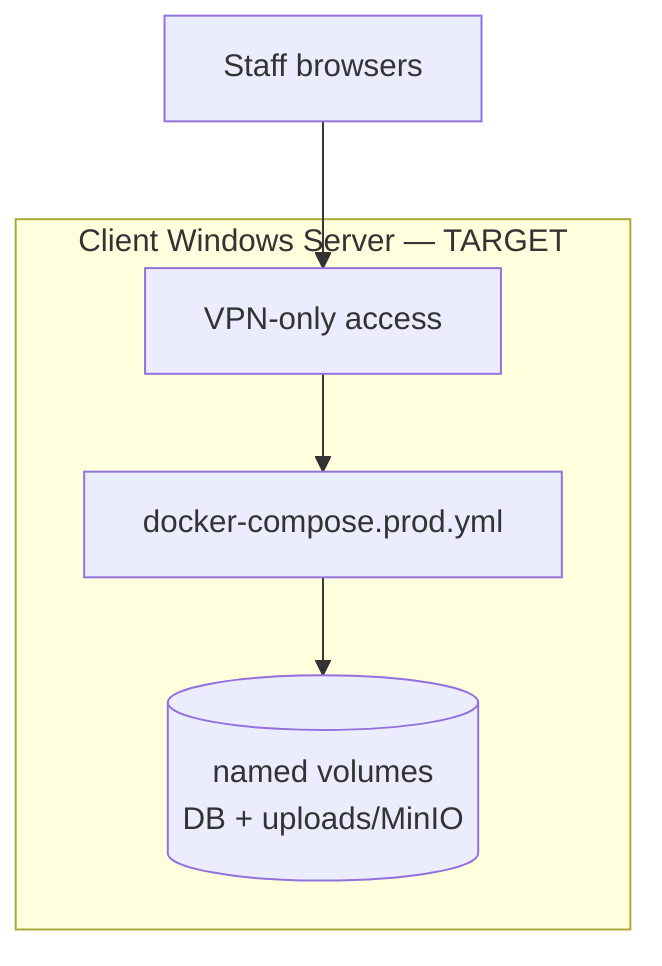

# Architecture — SWA ERP

Canonical architecture for evaluators and operators. Diagrams use Mermaid (renders on GitHub).

> **Truth rule:** every box is marked **BUILT** or **TARGET**. This repo once had diagrams that
> implied MinIO/Celery existed before they did. Both shipped in **wave-31** (2026-08-10) and are
> **BUILT**. Do not regress that honesty.

Companion: strategic notes in [`plan/ARCHITECTURE.md`](../plan/ARCHITECTURE.md); ADRs in [`docs/decisions/`](decisions/).

---

## 1. System context

| Component | Status | Notes |
|-----------|--------|-------|
| React SPA + FastAPI | **BUILT** | Ports 3100 / 8100 in dev |
| PostgreSQL + Redis | **BUILT** | Compose services |
| Celery worker | **BUILT** (wave-31) | `src/backend/workers/`; compose `worker` |
| Local file storage | **BUILT** | Default `STORAGE_BACKEND=local` → `uploads/` |
| MinIO | **BUILT** (wave-31) | Opt-in; compose `minio` service |
| Prometheus `/metrics` | **BUILT** (wave-36) | Internal scrape; protect in prod |
| Sentry | **BUILT** (wave-36) | No-op without `SENTRY_DSN` |
| Client on-prem deploy | **TARGET** | Blocked on server facts (no IT dept) |
| Client portal | **TARGET / out of MVP** | Explicitly deferred in meetings |

---

## 2. Core-chain data model

The intellectual core — Inquiry → Client → Agreement → Token → Document Reference → Time Log.

Shared generator: `generate_reference_id(db, entity_type)` — per-`(type, year)` counter.
DBR and KDR share the `DBR` counter (client practice). See ADR-0002.

---

## 3. Request lifecycle

Layering (one concept per file, ~300-line soft cap):

`api/` → `services/` → `db/repositories/` → `models/` · schemas in `schemas/` · cross-cutting in `core/`.

---

## 4. Deployment topology

### Dev / local (BUILT — `make dev`)

### Production target (partially templated — facts OPEN)

Production compose + `.env.production.example` exist with `PENDING IT ANSWER (Q#)` markers.
Fill from [`deliverables/SEND_IT.md`](../deliverables/SEND_IT.md) / [`docs/INSTALL_NO_IT.md`](INSTALL_NO_IT.md).
**Do not invent hostname, ports, or cert facts.**

---

## 5. Module map (backend API)

| Domain | Responsibility | Wave |
|--------|----------------|------|
| Auth / users / health | JWT login, RBAC, `/healthz` `/readyz` | 1, 36 |
| Clients, projects, lifecycle | CRM + 8-step project lifecycle | 2 |
| BOQ / quotes | Upload, version, approve, PDF | 3 |
| Tasks | Assignments, kanban, comments | 4 |
| Vendors / materials / RFQs | Catalog + vendor RFQ | 5 |
| Documents / compliance | Files + NBC/ECBC/IGBC/IS checklists | 6 |
| Time / invoices / PnL | 15-min increments, GST invoices | 7 |
| Reports / exports / jobs | Dashboards, sync+async export | 8, 31 |
| **Inquiries / agreements / tokens / doc refs** | **Core ID chain** | **9** |
| Sustainability | Energy / CO₂ / payback | 10 |
| Notifications | In-app bell | 24 |

---

## 6. Key decisions

| ADR | Topic |
|-----|-------|
| [0001](decisions/0001-tech-stack.md) | Tech stack (FastAPI, React, PG, Celery, Compose) |
| [0002](decisions/0002-core-id-chain-gap.md) | Core ID-chain gap — requirements misread & recovery |
| [0003](decisions/0003-it-server-call-brief.md) | IT / server call brief |
| [0004](decisions/0004-meeting-2-flow-and-next-steps.md) | Meeting 2 flow & next steps |

---

## 7. What is deliberately out of scope

From client meetings (see `resources/MEETINGS_MASTER.md`): HR/Admin sheets, founder-only finance sheets, employee/client satisfaction, complaints, marketing analytics, client portal (deferred).
