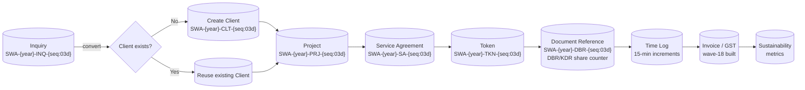
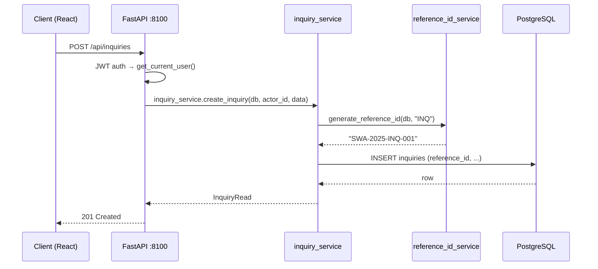
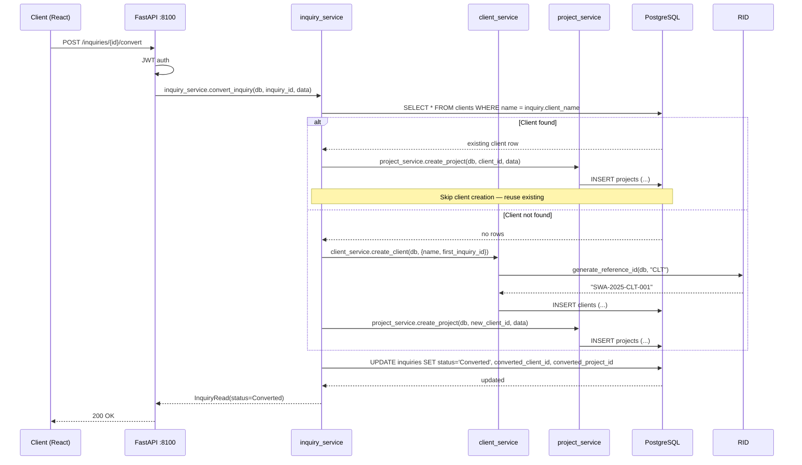
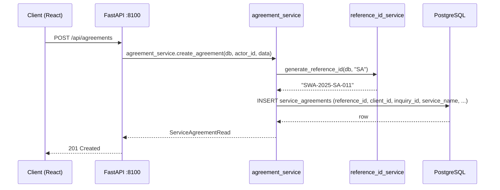
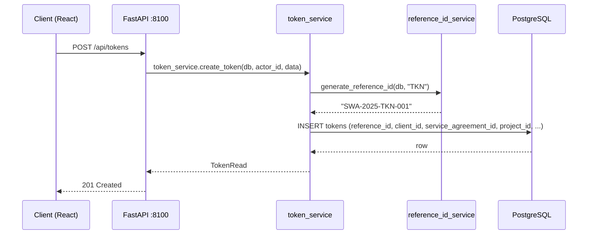
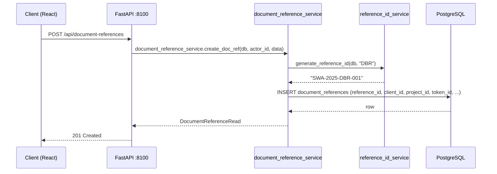
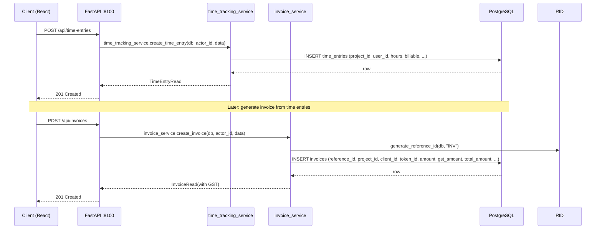
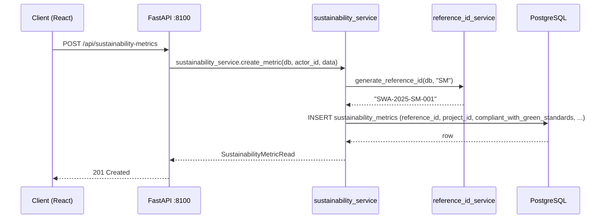

# Flow: Core ID Chain End-to-End

The intellectual core of this project. The client's actual workflow (Meeting 1 + Meeting 2),
NOT a generic CRM.

**Status:** BUILT — all entities and API endpoints exist.

---

## Overview

## Step-by-step

### 1. Inquiry (SWA-{year}-INQ-{seq:03d})

**Endpoint:** `POST /api/inquiries` — `inquiries.py:12`

**Fields from real Inquiries Sheet.xlsx:** Sr No, Inquiry ID, Inquiry Date, Inquiry Type,
Inquiry Source, Client Name, Requirement Summary, Estimated Value, Priority, Status, Owner,
Technical Lead, Notes.

**Reference ID:** `SWA-{year}-INQ-{seq:03d}`, atomic per-year counter.

---

### 2. Client (SWA-{year}-CLT-{seq:03d})

Client creation happens two ways:
1. Directly via `POST /api/clients` (CRM entry)
2. Via Inquiry conversion (`POST /inquiries/{id}/convert`)

**Conversion flow (from client's own words, Meeting 2 transcript):**

> "we inquire the first time into the system, then if the inquiry converts, then we go into the
> client database, check if the client already exists. If the client exists, we go to the project
> and add the project... If the client does not exist, we first add the client details and then
> go to the project and add the project."

**Endpoint:** `POST /inquiries/{id}/convert` — `inquiries.py`

**Edge case:** If `end_date` before `start_date` → 422. Ambiguous client-name match → 300-style
response listing candidates, require `client_id` to disambiguate.

**Client fields missing from original model (patched in wave-9 migration 0017):**
- `industry: String(100)` — from real Client Sheet.xlsx
- `client_status: String(50)` — dropdown, e.g. "Dormant"
- `first_inquiry_id: FK → inquiries.id` — tracks conversion source
- `first_lead_id: String(30)` — legacy LDI-* value (IMPORTER IGNORES this column)

---

### 3. Service Agreement (SWA-{year}-SA-{seq:03d})

**Endpoint:** `POST /api/agreements` — `agreements.py`

**Key:** `service_name` is FREE TEXT, not an enum. The real sample value from Service Agreements
Sheet.xlsx is "INSUDESIGN" — this doesn't match the verbally-named list at all. Confirms the enum
approach would be wrong on day one.

**Reference ID:** `SWA-{year}-SA-{seq:03d}`.

---

### 4. Token (SWA-{year}-TKN-{seq:03d})

**Endpoint:** `POST /api/tokens` — `tokens.py`

**Reference ID:** `SWA-{year}-TKN-{seq:03d}`.

---

### 5. Document Reference (SWA-{year}-DBR-{seq:03d})

**Endpoint:** `POST /api/document-references` — `document_references.py`

**Key design decision (ADR-0002 #4):** The DRN sheet has TWO different header rows — one says
"Associated Project ID", another says "Associated Project/Token ID". Rather than picking one FK and
guessing wrong, DocumentReference has BOTH `project_id` (required) and `token_id` (nullable).

**Reference ID:** `SWA-{year}-DBR-{seq:03d}`. DBR and KDR share the same counter.

---

### 6. Time Log → Invoice / GST

**Time entries:** 15-minute increments, `billable` flag. — `time_tracking.py`

**Invoices:** GST built in wave-18 (commit 2073c36 "invoice GST"). Fields: `amount`, `gst_amount`,
`total_amount`. — `invoices.py`

---

### 7. Sustainability Metrics (SWA-{year}-SM-{seq:03d})

**Endpoint:** `POST /api/sustainability-metrics` — `sustainability_metrics.py`

**Fields (corrected from first pass, wave-10):**
- `compliant_with_green_standards: Boolean` (not string)
- `payback_period_months: Integer` (not years)
- `insulation_efficiency: Float` ratio (not percentage)

---

## Reference ID scheme summary

| Entity | Code | Format | Counter |
|--------|------|--------|---------|
| Inquiry | INQ | SWA-{year}-INQ-{seq:03d} | Per-year, atomic |
| Client | CLT | SWA-{year}-CLT-{seq:03d} | Per-year, atomic |
| Service Agreement | SA | SWA-{year}-SA-{seq:03d} | Per-year, atomic |
| Token | TKN | SWA-{year}-TKN-{seq:03d} | Per-year, atomic |
| Document Reference | DBR | SWA-{year}-DBR-{seq:03d} | Per-year, shared with KDR |
| Sustainability Metric | SM | SWA-{year}-SM-{seq:03d} | Per-year, atomic |
| Project | PRJ | SWA-{year}-PRJ-{seq:03d} | Per-year, atomic |

**Generator:** `src/backend/services/reference_id_service.py:generate_reference_id(db, entity_type)`

**Counters:** `reference_counters` table, keyed by `(entity_type, year)`. Resets each calendar year.

**Confirmed by Viraj** (ADR-0002, Aug 2026): "Yes — reset every year, everywhere."

---

## BUILT vs TARGET-STATE

- **BUILT:** All 7 entities, all API endpoints, reference_id_service, atomic per-year counters,
  GST on invoices, sustainability metric fields corrected.
- **TARGET-STATE:** None — the core chain is complete.
