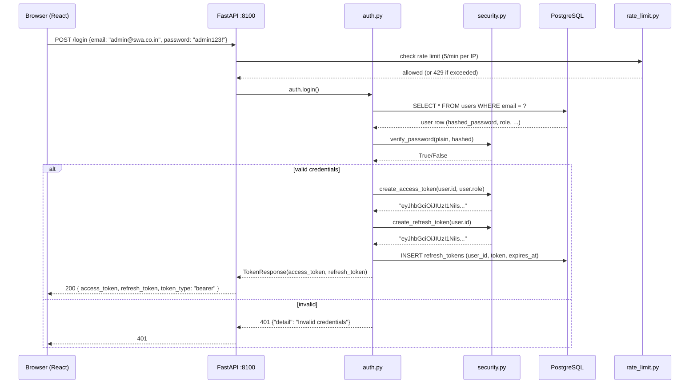
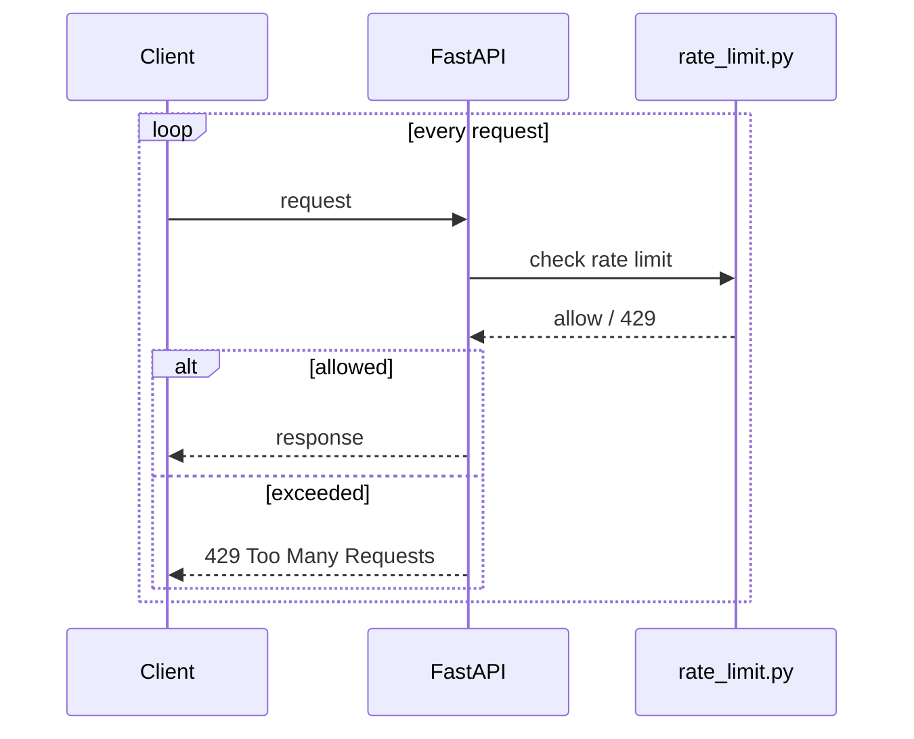
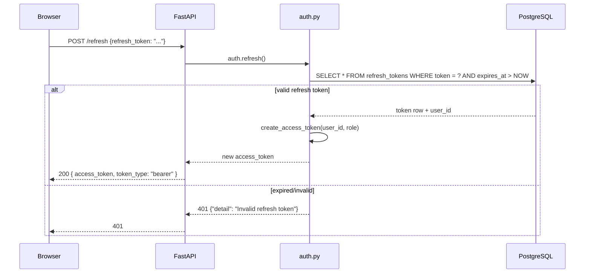

# Flow: Authentication + RBAC

**Status:** BUILT — JWT + RBAC implemented. Security hardening in wave-18.

---

## Overview

```mermaid
flowchart TB
    subgraph Client["Client Browser"]
        FE[React 18 SPA<br/>LoginPage.tsx<br/>TokenResponse handling<br/>localStorage/sessionStorage<br/>Authorization: Bearer header]
    end

    subgraph API["FastAPI :8100"]
        AUTH[auth.py router<br/>POST /login<br/>POST /refresh<br/>POST /logout<br/>POST /initialize]
        DEP[get_current_user()<br/>dependency<br/>decodes JWT<br/>returns User]
        DEP2[get_current_active_user()<br/>dependency<br/>checks is_active]
        RBAC[Role check<br/>admin / pm / designer / auditor / viewer]
    end

    subgraph DB["PostgreSQL"]
        USERS[users table<br/>id · email · hashed_password<br/>full_name · role · is_active<br/>created_at · updated_at]
        REFRESH[refresh_tokens table<br/>id · user_id · token ·<br/>expires_at · created_at]
        RATE[Limiter<br/>DISABLE_AUTH_RATE_LIMIT=1<br/>in test suite<br/>5/min default in prod]
    end

    FE -->|POST /login {email, password}| AUTH
    AUTH -->|verify bcrypt| USERS
    AUTH -->|create JWT access token| FE
    AUTH -->|create refresh token| REFRESH
    FE -->|GET /api/*<br/>Authorization: Bearer {token}| DEP
    DEP -->|decode JWT → user_id| USERS
    DEP -->|return UserRead| FE

    style USERS fill:#ccffcc,stroke:#006600
    style AUTH fill:#ccffcc,stroke:#006600
```

---

## Login flow



**Endpoints:**
- `POST /login` — `auth.py` — returns `access_token`, `refresh_token`, `token_type`
- `POST /refresh` — `auth.py` — exchanges refresh token for new access token
- `POST /logout` — `auth.py` — invalidates refresh token
- `POST /initialize` — `auth.py` — initial setup (creates first admin user)

**JWT config:** HS256, access TTL 60 min, refresh TTL 30 days — `src/backend/core/config.py`

---

## RBAC model

```mermaid
flowchart TB
    subgraph Roles["5 RBAC roles"]
        ADMIN[admin<br/>full access<br/>user management<br/>system config]
        PM[pm<br/>project management<br/>client CRUD<br/>inquiry conversion]
        DESIGNER[designer<br/>design work<br/>token creation<br/>document refs]
        AUDITOR[auditor<br/>compliance review<br/>read-only financials<br/>standards]
        VIEWER[viewer<br/>read-only<br/>dashboard<br/>no mutations]
    end

    subgraph Protected["Protected endpoints"]
        AUTH_E[Auth endpoints<br/>login/refresh/logout/initialize<br/>public + rate-limited]
        CRUD_E[CRUD endpoints<br/>POST/GET/PATCH/DELETE<br/>/api/clients, /api/inquiries,<br/>/api/agreements, /api/tokens,<br/>/api/document-references,<br/>/api/projects, /api/quotes,<br/>/api/rfqs, /api/boqs,<br/>/api/invoices, /api/time-entries,<br/>/api/sustainability-metrics,<br/>/api/vendors, /api/materials,<br/>/api/tasks, /api/notifications]
        FIN_E[Financial endpoints<br/>/api/projects/{id}/pnl<br/>/api/reports/financial.pdf<br/>/api/utilization<br/>/api/revenue<br/>/api/project-health<br/>role-gated]
        COMP_E[Compliance endpoints<br/>/api/standards<br/>/api/standards/{id}/checklist<br/>/api/items/{id}/review<br/>review-gated]
    end

    ADMIN --> CRUD_E
    ADMIN --> FIN_E
    ADMIN --> COMP_E
    PM --> CRUD_E
    PM --> FIN_E
    DESIGNER --> CRUD_E
    DESIGNER -->|token + doc ref creation| CRUD_E
    AUDITOR -->|compliance review| COMP_E
    AUDITOR -->|read financials| FIN_E
    VIEWER -->|read-only| CRUD_E
    VIEWER -->|dashboard| FIN_E

    style ADMIN fill:#ccffcc,stroke:#006600
    style PM fill:#ccffcc,stroke:#006600
```

**Role → permissions mapping (verified from codebase, wave-22):**

| Role | Can create | Can read | Can update | Can delete | Restricted |
|------|-----------|----------|------------|------------|------------|
| admin | everything | everything | everything | everything | — |
| pm | clients, inquiries, projects, agreements, tokens, doc_refs, quotes, rfqs, boqs, invoices, time_entries, tasks, vendors, materials, sustainability | everything | everything (own + assigned) | own + assigned | — |
| designer | tokens, document_references, time_entries | everything | own | — | — |
| auditor | — | everything (read-only) | compliance items (review) | — | no mutations on core chain |
| viewer | — | everything (read-only) | — | — | no mutations |

**Role checking:** Done via `get_current_user()` dependency which decodes the JWT and returns the
user object including `role`. Endpoint handlers check `current_user.role` against allowed roles.

**Wave-22 security hardening:** Materials endpoints authenticated, financial modules (project_pnl,
exports, invoice-status) role-gated, core-chain RBAC matrix matches client access matrix (PM+Designer
for DBR/KDR, Auditor+Designer for Reforge), compliance-review and task/RFQ transitions gated.

---

## Rate limiting (wave-18, BUILT)



**Default:** 5 auth calls per minute per client IP.

**Test suite:** `DISABLE_AUTH_RATE_LIMIT=1` set in `tests/conftest.py` before app import.
Undone per-test in wave-18's own tests via `monkeypatch.setenv`.

**Gotcha (wave-26 report):** The rate limiter can kill the whole backend test suite — commit
`3e0f137` fixed 177 errors caused by it. Produces unrelated-looking mass failures, not an obvious
single error in the failing module.

---

## Token refresh flow



---

## BUILT vs TARGET-STATE

- **BUILT:** JWT + bcrypt auth, 5 RBAC roles, rate limiting, refresh tokens, security hardening
  (wave-18: prod refuses insecure SECRET_KEY, 429 on rapid login).
- **TARGET-STATE:** None — auth + RBAC is complete. Residual risk: server deploy is external
  (no IT dept), so prod SECRET_KEY management is outside our control.
