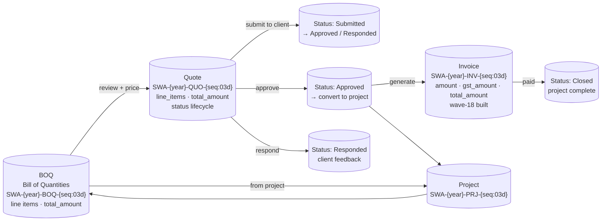
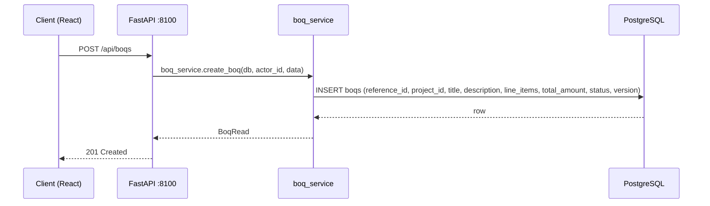
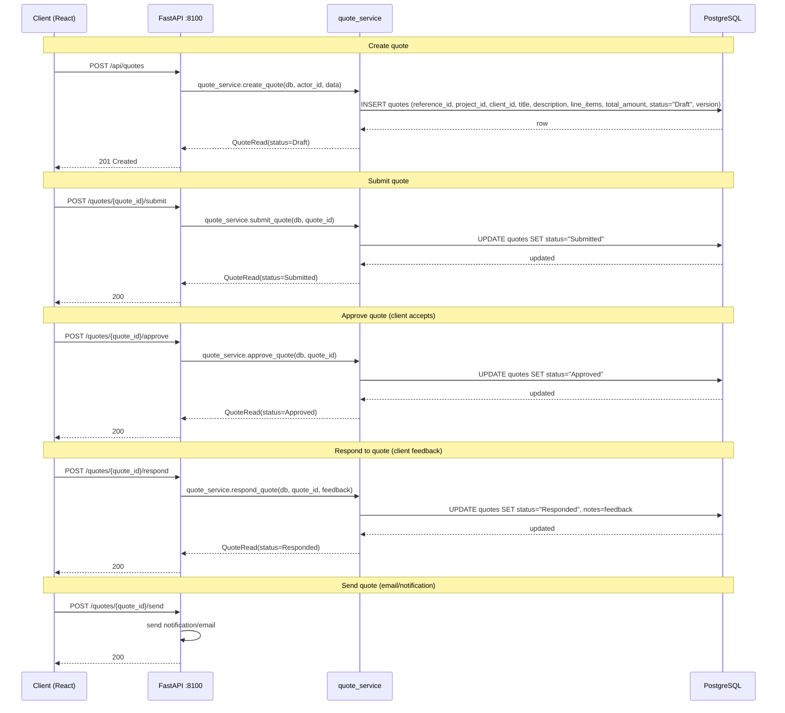
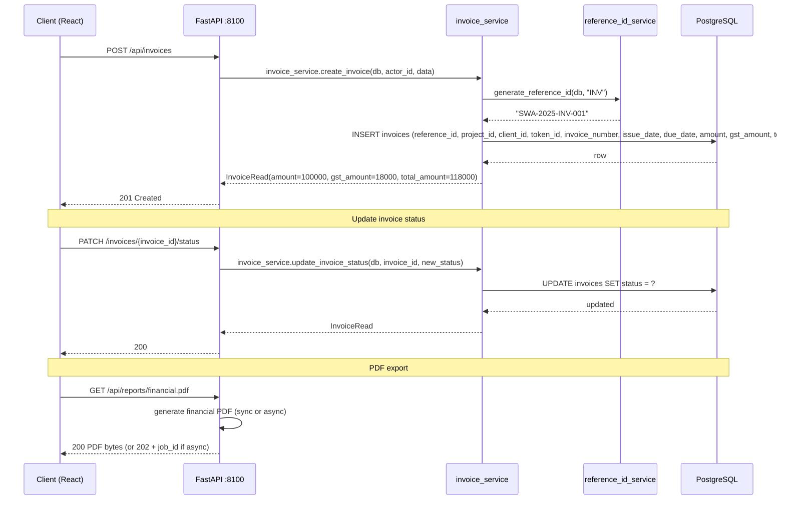
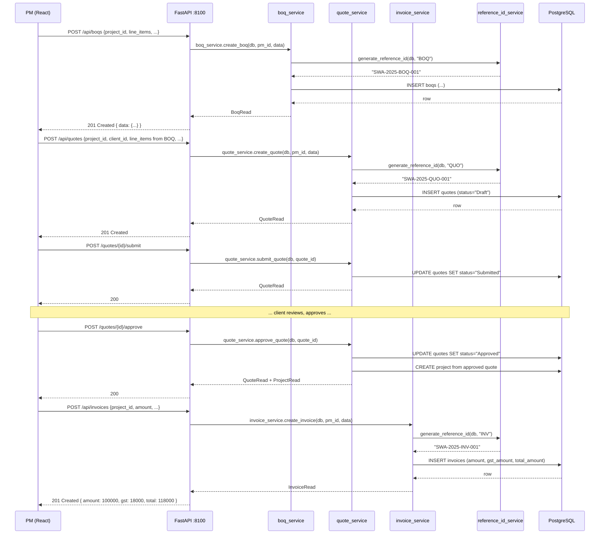

# Flow: BOQ → Quote → Invoice

The commercial workflow: from bill of quantities through quotation to invoicing.

**Status:** BUILT — BOQ models, quote workflow, invoicing with GST all exist.

---

## Overview

---

## BOQ (Bill of Quantities)

**Model:** `src/backend/models/boq.py`

**Fields:** id, reference_id (SWA-{year}-BOQ-{seq:03d}), project_id, title, description,
line_items (JSON), total_amount (Decimal), status, version, created_at, updated_at, deleted_at.

**Ingestion:** BOQ can be uploaded as JSON or Excel. The importer (`scripts/import_excel.py`,
wave-13) handles Excel→ERP data migration. Never call `rfq2boq` directly — it's an independent
product.

**Reference ID:** `SWA-{year}-BOQ-{seq:03d}`.

---

## Quote workflow

**Model:** `src/backend/models/quote.py`

**Fields:** id, reference_id (SWA-{year}-QUO-{seq:03d}), project_id, client_id, title, description,
line_items (JSON), total_amount (Decimal), status (Draft/Submitted/Approved/Responded),
version, created_at, updated_at, deleted_at.

**Status lifecycle:**
1. Draft → Submit → Submitted
2. Submitted → Approve → Approved (client accepts)
3. Submitted → Respond → Responded (client feedback)
4. Approved → convert to project → status stays "Approved"

**Endpoints:**
- `POST /api/quotes` — create
- `PATCH /quotes/{quote_id}` — update
- `DELETE /quotes/{quote_id}` — soft delete
- `POST /quotes/{quote_id}/submit` — submit to client
- `POST /quotes/{quote_id}/approve` — client approves
- `POST /quotes/{quote_id}/respond` — client responds with feedback
- `POST /quotes/{quote_id}/send` — send (notification/email)
- `GET /quotes/{quote_id}` — read
- `GET /api/quotes` — list

**PDF export:** `GET /quotes/{quote_id}/pdf` — generates quote PDF (synchronous or async via Celery).

---

## Invoice (with GST)

**Model:** `src/backend/models/invoice.py`

**Fields:** id, reference_id, project_id, client_id, token_id, invoice_number, issue_date, due_date,
amount (Decimal), gst_amount (Decimal), total_amount (Decimal), status, created_at, updated_at,
deleted_at.

**GST:** Built in wave-18 (commit 2073c36 "invoice GST"). `total_amount = amount + gst_amount`.

**Status lifecycle:** Draft → Issued → Paid → Closed (or Cancelled).

**Endpoints:**
- `POST /api/invoices` — create
- `PATCH /invoices/{invoice_id}/status` — update status
- `DELETE /invoices/{invoice_id}` — soft delete
- `GET /invoices/{invoice_id}` — read
- `GET /api/invoices` — list

---

## BOQ → Quote → Invoice end-to-end

---

## BUILT vs TARGET-STATE

- **BUILT:** BOQ models + Excel/JSON ingestion, full quote status lifecycle (Draft→Submitted→
  Approved→Responded), invoice with GST (wave-18), PDF export for quotes and financial reports,
  async export via Celery.
- **TARGET-STATE:** None — the BOQ→Quote→Invoice flow is complete.
