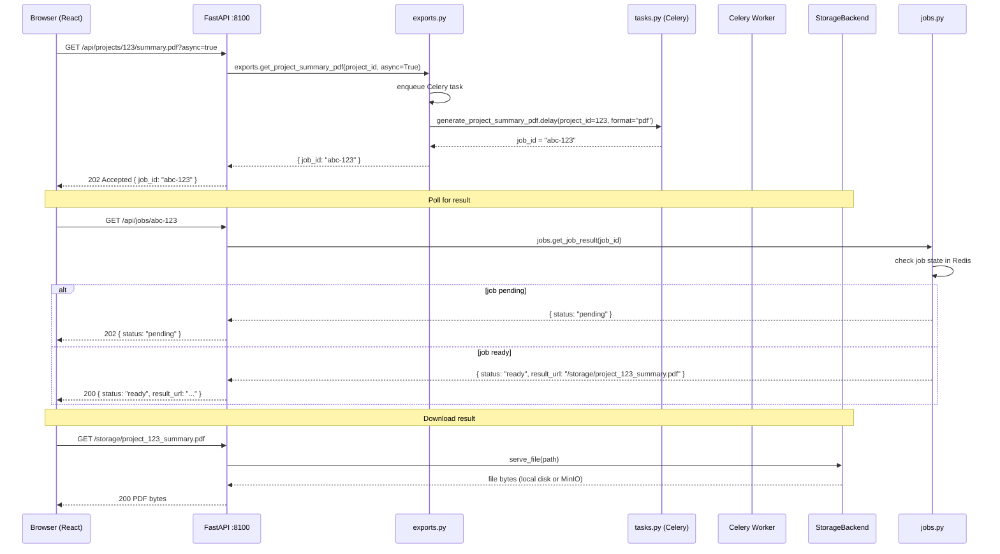
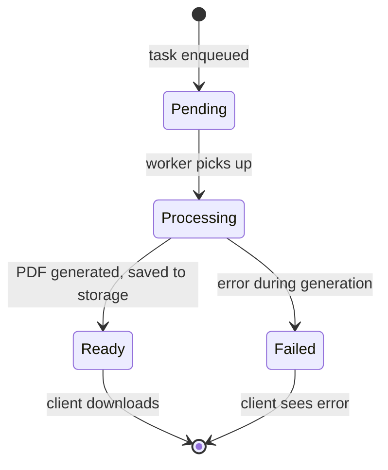

# Flow: Async Export via Celery

Async PDF/report generation via Celery workers. Built in wave-31.

**Status:** BUILT — Celery app, workers, async export endpoints, job tracking all exist.

---

## Overview

```mermaid
flowchart TB
    subgraph Client["Client Browser"]
        FE[React 18 SPA<br/>fetch /api/projects/{id}/summary.pdf<br/>?async=true parameter]
    end

    subgraph API["FastAPI :8100"]
        EXPORTS[exports.py router<br/>GET /api/projects/{id}/summary.pdf<br/>GET /api/projects/{id}/slides.pdf<br/>GET /api/reports/financial.pdf<br/>?async=true → enqueue job]
        JOBS[jobs.py router<br/>GET /api/jobs/{job_id}<br/>poll job status<br/>result_url when ready]
    end

    subgraph Workers["Celery Workers"]
        WORKER[celery -A src.backend.workers.celery_app worker<br/>Redis broker/backend<br/>tasks.py: generate_project_summary_pdf<br/>tasks.py: generate_financial_report_pdf]
    end

    subgraph Storage["Storage Backend"]
        LOCAL[local uploads/<br/>default · gitignored<br/>created at runtime]
        MINIO[MinIO<br/>STORAGE_BACKEND=minio<br/>opt-in · NOT active by default]
    end

    FE -->|GET /api/projects/123/summary.pdf?async=true| EXPORTS
    EXPORTS -->|enqueue: generate_project_summary_pdf.delay(project_id, format)| WORKER
    EXPORTS-->>FE: 202 Accepted { job_id: "abc-123" }
    FE -->|GET /api/jobs/abc-123| JOBS
    JOBS -->|check Redis| WORKER
    WORKER -.->|processing...| STORAGE
    WORKER -->|complete| JOBS
    JOBS-->>FE: 200 { status: "ready", result_url: "/storage/..." }
    FE -->|GET /storage/...| STORAGE
    STORAGE-->>FE: PDF bytes

    style WORKER fill:#ccffcc,stroke:#006600
    style EXPORTS fill:#ccffcc,stroke:#006600
    style JOBS fill:#ccffcc,stroke:#006600
    style STORAGE fill:#ccffcc,stroke:#006600
    style MINIO fill:#fff3cd,stroke:#ffc107,stroke-dasharray: 5 5
```

---

## Request flow (async)



**Endpoint:** `GET /api/projects/{project_id}/summary.pdf` — `exports.py`

**Async parameter:** `?async=true` → returns 202 with job_id immediately. Without it → synchronous
PDF generation (blocks until done).

**Job tracking:** `GET /api/jobs/{job_id}` — `jobs.py` — returns `{ status: "pending" | "ready" | "failed", result_url?: string }`.

---

## Celery worker internals

```mermaid
flowchart LR
    subgraph Broker["Redis Broker"]
        Q[pending task queue]
    end

    subgraph Worker["Celery Worker Process"]
        APP[celery_app.py<br/>Celery(app_name="worker",<br/>broker=redis://localhost:6379/0,<br/>backend=redis://localhost:6379/0)]
        TASKS[tasks.py<br/>@task<br/>generate_project_summary_pdf(project_id, format)<br/>generate_financial_report_pdf(project_id)]
        DB_CONN[_worker_engine<br/>SQLAlchemy engine<br/>pool_pre_ping=True]
    end

    subgraph Storage["Storage"]
        OUT[output directory<br/>local uploads/ or MinIO]
    end

    Q -->|push task| APP
    APP -->|pop task| TASKS
    TASKS -->|render PDF| OUT
    TASKS -->|SQL queries| DB_CONN

    style APP fill:#ccffcc,stroke:#006600
    style TASKS fill:#ccffcc,stroke:#006600
```

**Celery app:** `src/backend/workers/celery_app.py`

```python
# Conceptual structure (not exact code)
Celery(
    app_name="worker",
    broker="redis://localhost:6379/0",
    backend="redis://localhost:6379/0",
)
```

**Tasks:** `src/backend/workers/tasks.py`

- `generate_project_summary_pdf(project_id: int, format: str = "pdf") → str`
  Returns the storage path of the generated PDF.
- `generate_financial_report_pdf(project_id: int) → str`
  Returns the storage path of the generated financial PDF.

**Worker process:** `celery -A src.backend.workers.celery_app worker` — defined in
`docker-compose.yml` as a separate service.

**Worker DB connection:** Separate engine `_worker_engine` in `tasks.py` with `pool_pre_ping=True`.
This is independent of the web app's engine — the worker has its own DB sessions.

---

## StorageBackend abstraction

```mermaid
flowchart LR
    subgraph API["FastAPI"]
        E[exports.py]
    end

    subgraph ABSTRACT["StorageBackend Protocol"]
        LOCAL[local storage<br/>save(path, data) → local disk<br/>load(path) → file bytes<br/>delete(path)]
        MINIO[minio storage<br/>save(path, data) → S3 PUT<br/>load(path) → S3 GET<br/>delete(path) → S3 DELETE]
    end

    E -->|storage_backend.save(path, pdf_bytes)| ABSTRACT
    ABSTRACT -->|config: STORAGE_BACKEND| LOCAL
    ABSTRACT -.->|config: STORAGE_BACKEND=minio| MINIO

    style LOCAL fill:#ccffcc,stroke:#006600
    style MINIO fill:#fff3cd,stroke:#ffc107,stroke-dasharray: 5 5
```

**Protocol:** `src/backend/core/storage.py`

```python
class StorageBackend(Protocol):
    def save(self, path: str, data: bytes) -> str: ...
    def load(self, path: str) -> bytes: ...
    def delete(self, path: str) -> None: ...
    def url(self, path: str) -> str: ...
```

**Default:** `local` — saves to `uploads/` directory (gitignored, created at runtime).

**Opt-in:** `minio` — sets `STORAGE_BACKEND=minio` environment variable.

**Gotcha:** MinIO is NOT active by default. The storage abstraction is built and tested with local
storage. Switching to MinIO requires the environment variable AND a running MinIO instance.

---

## Synchronous vs async export

| Mode | Parameter | Response | Use case |
|------|-----------|----------|----------|
| Sync | (none) | 200 + PDF bytes immediately | Small exports, quick generation |
| Async | `?async=true` | 202 + job_id | Large exports, PDF generation that takes seconds |

**Sync path:** `exports.py` generates PDF inline, returns bytes directly.

**Async path:** `exports.py` enqueues Celery task, returns job_id. Client polls `/api/jobs/{id}`
until `status: "ready"`, then downloads from `result_url`.

---

## Job lifecycle



**States:**
- `pending` — task enqueued, not yet picked up by worker
- `processing` — worker is executing the task
- `ready` — task complete, `result_url` available
- `failed` — task failed, error info available

---

## BUILT vs TARGET-STATE

- **BUILT:** Celery app + worker process, async export endpoints (`?async=true`), job tracking
  (`GET /api/jobs/{id}`), StorageBackend protocol (local default), PDF generation tasks
  (project summary, financial report), Docker Compose worker service.

- **TARGET-STATE:** MinIO active by default (currently opt-in only). Celery monitoring (no flower
  or Prometheus metrics for Celery tasks yet).
